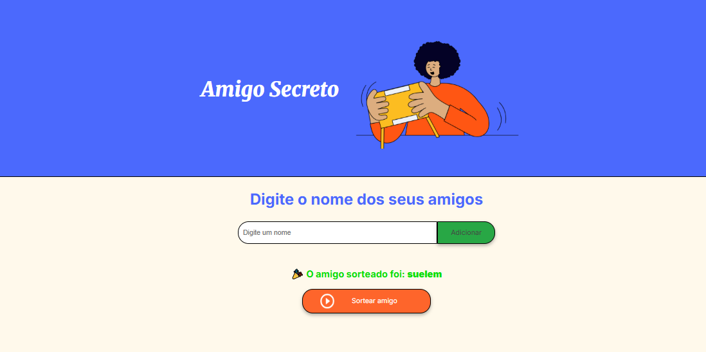

# 🎁 Projeto Amigo Secreto

Este é um projeto desenvolvido como parte do desafio da **Alura** em parceria com o programa **Oracle Next Education (ONE)**. A proposta era criar uma aplicação web simples, divertida e interativa que sorteasse os nomes dos participantes de um **Amigo Secreto** de forma automática e confidencial.

## 🚀 Tecnologias Utilizadas

HTML

CSS

JavaScript

## 🎯 Objetivo do Projeto

O objetivo deste desafio foi praticar **JavaScript**, **manipulação do DOM**, e o uso de **eventos**, além de consolidar conhecimentos de **HTML** e **CSS**. O resultado é um pequeno aplicativo que permite:

1. Cadastrar os nomes dos participantes;
2. Sortear automaticamente quem será o amigo secreto de cada pessoa;

## 🖼️ Imagem do Projeto

---

## ✨ Feito com carinho por Suelem Martins

💻 Desenvolvido com:  
HTML • CSS • JavaScript  

🚀 Projeto do desafio da **Alura + Oracle Next Education**

📍 Blumenau/SC — Brasil

📫 Contato: suelemnascinto@gmail.com

---

🌟 Obrigada por visitar meu projeto!  
Se gostou, deixe uma ⭐ no repositório!

  

